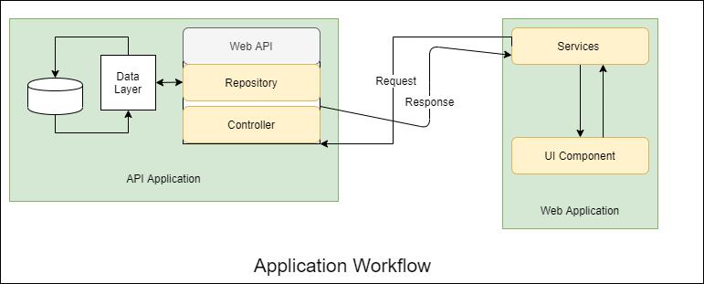

# System Architecture of Ride Sharing App
## Introduction
Its an architecture document for a Ride Sharing App.

### Document Overview
This document describes the architecture of Ride Sharing App.
It describes:
- A general description of system and requirements
- The logical architecture of software, the layers and top-level components
- The physical architecture of the hardware on which runs the software
- The justification of technical choices made
- The traceability between the architecture and the system requirements.

## Functional and Non Functional Requirements
### Functional Requirements
1. User Registration
    - User must be able to register for the application through a valid email or phone. User should be get the activation link or activation code on mail or phone after registration for validation.

2. Choose Route
    - User must be able to select the pickup and drop location. 

3. Notification
    - Ride App registered driver nearby the pickup locations should be notified for pickup request. 
    - User should be notified if any of the driver accept the pickup request with the current location of the driver.

4. Confirm the ride
    - User must be able to select the ride from the list of accepted request and confirm for the ride.
    - Ride App registered driver need to be notified after the confirmation.
    - Total cost for the ride need to be calculated and user should have the option to pay with wallets/banks. Cash can be the option and need to pay after he gets picked up for the ride.

5. Feedback and rating
    - User must be able to provide feedback regarding the ride and the person.

### Non Functional Requirements
1. Privacy 
    - Password for the app must be highly secured Min 8 Characters and Capital/Special Character and Digit validation. 
    - Digital Wallets and Bank information should be highly secured and should avoid the saving of those information on the application. 
    - Try get these information on the fly using the APIs and remove the information after its use. 

2. Robustness 
    - DataServer must have specific backup schedule so as to recover the history on any kind of system crash.
    - Application is more over the cash or money transaction so need to log every information regarding the transaction as well as the location of the rider and driver as much as possible

3. Performance 
    - Application must be as quick as possible. 
    - Notification should be instant so as to robust the app use.

## Use Case Table

### Use Case Description
#### Authentication 
Both type of user admin and normal has to be authenticated through the system. Normal user has to register with his/her email address or phone number and need to be verified before logging in to the system
- Register
- Login
- Logout

[Note: Specific Use Case Diagram can be displayed if necessary]
#### Manage Friends
Authenticated user can add, block or remove friends, create group of friends for chat and manage them. 
- Friend List
- Find friend
- Add Friend
- Create group
- Remove Friend
- Block Friend

[Note: Specific Use Case Diagram can be displayed if necessary]
#### Chat
Authenticated user can send or receive message from another user. Notification will be displayed for message delivery, message received and new message arrival. Live chat must be possible without any delay.
- Send
- Receive
- Broadcast

[Note: Specific Use Case Diagram can be displayed if necessary.]
#### Manage and Monitor
Normal user can view chat history and search message on the history. Admin can manage the profile and block or remove the user on misconduct or misuse of the application and manage the feedback.
- Manage Profile
- View History
- Feedback

[Note: Specific Use Case Diagram can be displayed if necessary]
### Activity Diagram
Activity diagram below shows an user workflow of the application starting from authentication to different activity.

[Note: Other diagram specific to different activity in the application can be displayed and explained if necessary]

### Entity Relationship Diagram
ER-Diagram below displays the relation between data entity required for the applications. It just explains the database entities involved. 

## Architecture
### Architecture Overview
It’s a basic chat application where any mobile or desktop user can resister and start chatting with another registered user. User can chat with each other whenever he/she is add to his friend circle. The chat can be live if the user is online otherwise the message is shown whenever the user gets online. There will be two or more user involved in the system. One is the source of message and second one is target which can be multiple.

### Physical Architecture Overview
Physically we can have three different server for database, api and web application which can be in same enterprise server or single cloud server. ASP.NET Web API can be hosted on Amazon Web Component service for Web API and Data Component service for database can be an easier option for easy continuous integration.

### Logical Architecture Overview
Logically application has three basic components one is api server *'API Component'* which is called *'API'* below. build with ASP.NET MVC Web API architecture. API stores and receives the data from another component *'Database Component'* which is called *'Data'* below. 'API' receives the request from web application and responds back to the web application which is third component called *'Web Component'* which is called *'Web App'*.

#### API Component
'API' is responsible for communicating with 'Web App' for saving and receiving data. There must not be other way out to save and retrieve data except 'API'. 'API' consists of two layers 'Data Layer' and 'Controller' where controller is responsible for handling request and response from 'Web App' where as data layer is responsible for handling (saving and receiving) data from database. 'API' should be made secure so as to block the unnecessary access to the data, basic authentication using username and password can be used for API security but to make more secure OAuth 2.0 can be used.The process can be easily be understood in the above 'Application Work Flow' diagram.

Class Diagram for Data layer of the 'API' can be shown as below.

#### Database Component
'Data' is completely a database server responsible for storing the data in the form of tables and columns. All the data tables and their columns are defined in Data Entity ER-Diagram defined above. This component is just available or can be accessed through data layer of 'API'.
#### Web Component
'Web App' is a web chat application consisting of different pages from authentication to different dashboard activities. There will be a dashboard for normal user for managing friends, chatting and checking with history. There will be another admin dashboard for admin user so as to handle feedback and user profiles.

'Web App' should contain two layers one is service layer for 'API' communication and UI Layer for client request processing. File handling (sharing) is completely handled by 'Web App' just file information is handled in database for user notification.

## Development Process
Requirement and architecture defined above ultimately guide us to separate our development in two basic team. A team responsible for managing the 'API' who are further responsible for managing the database as well, another team looking after the 'Web App'. Two different git repository for these two different part needs to be managed so as there is complete separation of concern during development. Continuous Integration needs to be implemented with deployment to DEV or QA server on development merge in both the repository. Complete git flow needs to be managed during development so that there will be less conflict during merge.

TDD(Test Driven Development) implementation on development can reduce the time for manual test. Automation on testing process can be implemented from day 1 of development and each unit of code must have its unit testing followed by integration testing for each functionality. Test automation for each pages of 'Web App' reduces the manual QA task except some required manual test on high complexity.

Each developer should have to go through a cycle of pull request in development, staging and master branch. Automatically code must run unit tests and integration test after the pull request merge for clean deployment. Automation test should be run on each build so as to verify the deployment. A good code of conduct to be maintained before starting the development. A team meeting will define the code work flow and coding process and requirement of approving a pull request.

There is just a single choice of using ASP.NET Web API for 'API' can have an option of using different databases like POST gres, mysql or any other but MS-SQL server which is best suit for ASP.NET Web API. 

MS-SQL Server is the choosen option for the instance till data is handled by SQL Express. If application goes higher for serving thousand of users then other options may require. For the reason, a separate data layer which can be easily replaced by another one is to be created during development.

'Web App' development can have an option of choosing any js framework (Angular, React  or Vue). Any of those three framework can be used on the basis of availability of developer and crusiality of the project. Angular can be an option for quick development. React can be the option for fast rendering as it works with virtual DOM and also can be a good one to go for react native for mobile app as architecture goes same for native. Vue also can be the option for easy learning curve and has existing feature of older frameworks and a complete MVMVM pattern is implemented within.

Team should sit together to define the framework to be used on 'Web App' before starting the development. Availability of knowledge, crusiality of the application would define the framework. 

There is need of both Web and mobile app for this one. For my personal view, going with React Js can be a good option. there is need of separation of concern on each View part of the application so as to change the view accordingly for web and mobile. Although two separate code base may require for native and mobile but can be quick second one after first one is developed.

[Note: A sample of TDD based application for Web API created during previous assessment is kept for reference. https://github.com/isapkota/Seva_Assessment]

## Test Plan
The testing activities are to be done in parallel with the development process along with the unit testing. Other than this each requirement functionality should be tested properly before taking it to production. Some of the test items are listed below along with its scope.

### Main Test Item
*1. 'Web App'* - The Chat Application developed

Items to be tested with application. Each item has to be tested properly and accessible to a registered user.
- User Profile
- Chatting
- Group Chatting
- Add Friend
- Remove Friend
- Block Friend
- Unblock Friend
- Find Friend
- Register
- Login
- Logout

*2. 'API'* - Supporting Infrastructure for Application
Every end point for each item listed above should be tested with proper and improper data so as to get the consequences of each action.

### Features to be tested
Features | Priority | Description
-------- | -------- | -----------
Create Account | 1 | To make user able to register for Chat App
Login | 1 | Login as Authenticated User
Logout| 1 | Get out of system
Find Friend | 2 | Searching for friend
Add Friend | 2 | Connect with friend
Remove Friend | 3 | Disconnect with friend
Block Friend | 3 | Remove unwanted message
Personal Chat | 1 | Message with friend
Group Chat | 2 | Message with group
Share File | 3 | Share files
Appropriate Messaging | 3 | Check for proper message on error and invalid inputs
Database | 2 | Technical check with data on database 
Encryption | 4 | Each message must be encrypted on save and received decrypted on request
Ensure the chat respond on minimal time | 4 | Ensure message is delivered on time

### Test Tools 
Selenium Web Browser java automation tool can be used for automating the test. Other than that, different javascript tools such as Protractor, Cypress are also introduced for browser automation. NUnit or xUnit can be used for unit testing during the development. Every features need step by step methods of testing before the development process starts.

### Item Pass Fail Criteria
The test process will be completed when the project owner will be satisfied with the result of the test. For this, at least 90% of test cases must pass; all functionalities must be covered in those test cases and most of all, high and medium severity defects must be detected and fixed. Minor defects can be ignored, but with the assurance that it does not lead to severe defect. The project owner will decide whether the detected defects and criticality will cause the release of Chat Application of version 1.0 to delay. The project owner can decide the deployment with known bugs but again there must be at least 90% test cases are passed and major feature must not halt the application.

### User Manual
On completion of first level of deployment a user manual using the screen shots of the application will be created for users to use all the features the application.

## Deployment
Continuous Integration will be implemented so as to get an easy deployment strategy. Three environments QA, Staging and Production with similar architecture are defined and prepared for deployment. Each deployment occurs on git push on different branches. Developers push the code to respective branch for deployment. There must be an manual process just to deploy for production.  The process will be defined by the team on project kick off meeting.

## Conclusion
There must be a room of improvement of the application. As it deals with communication, we must have other means of communication implementation like voice chat, video chat, group call etc. There must be flexibility of enhancing the application to the bigger approach afterwards.
